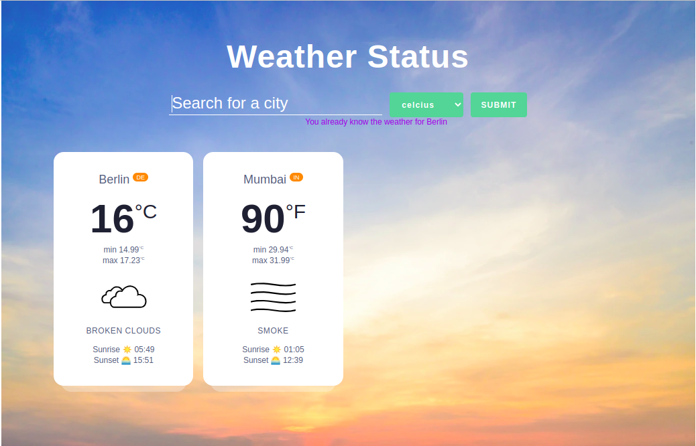
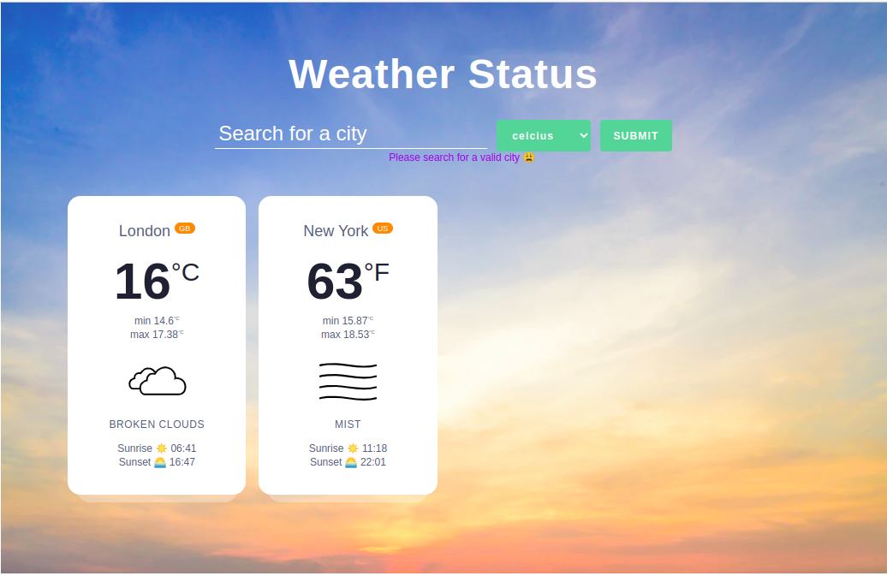
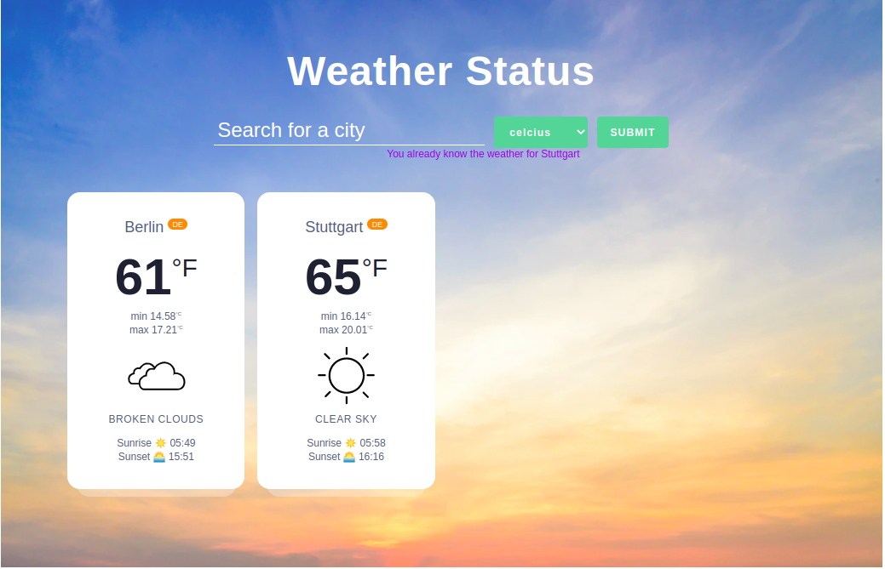

# Weather status using api from openweather

### The challenge

- design weather page and city weather cards

- create a form to get input for city name

- fetch weather data and ue try.. catch to handle errors

- Create a responsive page based using flex and media queries

### Screenshot

#### Desktop Version

- weather status
  

- weather with error status
  
- weather status with error
  

### Built with

- Semantic HTML5 markup
- CSS
- vanilla Javascript
- fectch
- Flex box
- Responsive design
- Animations
- Desktop layout

## Author

- Website - [Harshita Joshi-Github](https://github.com/harshita1225)
